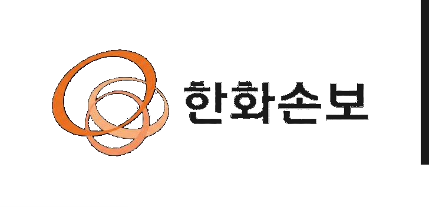

# HW-PPT — 한화손해보험 PPT 디자인 시스템

> **Energy for Life.** 한화손보 공식 템플릿 라이브러리(표지·투칼럼·As-Is/To-Be·파이·비교·표·상승) 기반.
> 매 호출이 동일한 룩앤필을 내도록 9개 아키타입과 좌표·토큰을 고정한 스킬.

## 이 스킬이 해결하는 문제

LLM에게 매번 "한화손보 톤으로 PPT 만들어줘"라고 말하면 매번 다른 오렌지·다른 레이아웃·다른 헤더가 나온다. 이 스킬은:

1. **9개 아키타입을 좌표 수준으로 고정** — 헤더(y=0–80), 타이틀밴드(y=130–270), 본문(y=300–820), Density Zone(y=840–1010)
2. **Density Zone 룰** — 슬라이드 하단의 빈 공간 문제 해결 (§6)
3. **오렌지 단색축** — `#ED6F1F` 베이스 + 4단계 변형으로 차트·강조 통일
4. **Anthropic pptx 스킬과 협업** — 디자인 표준은 이 스킬, 파일 생성은 pptx 스킬

## 작동 방식 (Anthropic pptx 스킬과의 역할 분담)

[Gabberflast/academic-pptx-skill](https://github.com/Gabberflast/academic-pptx-skill) 패턴을 따른다:

```
사용자 요청 ("한화손보 신상품 소개 5장")
         ↓
    hw-ppt 스킬 트리거
         ↓
   ┌──── 콘텐츠+디자인 레이어 (이 스킬) ────┐
   │  1. 9개 아키타입 중 적절한 것 선택       │
   │  2. 좌표·컬러·폰트·Density Zone 결정    │
   │  3. 헤더/시그니처 일관성 강제            │
   └──────────────┬───────────────────────┘
                  ↓
       파일 생성 레이어 (Anthropic pptx 또는 HTML)
                  ↓
        .pptx (기본) or HTML deck (옵션)
```

**의존성:**
- **`.pptx` 생성**: Anthropic 공식 [`pptx` 스킬](https://github.com/anthropics/skills/tree/main/skills/pptx) (python-pptx 기반)
- **HTML 생성**: 의존성 없음 (단일 파일 출력)
- **폰트**: hw-design 스킬의 한화체 .ttf 3종 활용 (B/L/R)

## 1. Hard Constraints (non-negotiable)

| 항목 | 규칙 |
|------|------|
| **종횡비** | 16:9 only. 캔버스 1920×1080 px (= 13.333" × 7.5") |
| **타이포** | 한화체 family only (Bold/Regular/Light). 시스템 폰트·구글 폰트 금지 |
| **로고** | 헤더는 **`hanwha-signature-ink.png` 한 장**(심볼+wordmark 합본, height 64 px, 텍스트 fill ink). 차트 중앙 등 심볼 단독 시 `hanwha-symbol.png`. 원본 `hanwha-signature.png`는 텍스트가 흰색 outline only라 orange-tint 헤더에서 안 보임 — `-ink` 버전 사용 필수 |
| **헤더** | 모든 콘텐츠 슬라이드에 동일 좌표 (y=0–80, x 마진 40 px 좌우 동일) |
| **타이틀** | y=130–270 밴드 고정 (좌·중앙 정렬은 아키타입별로 다름, 밴드 위치는 불변) |
| **밀도** | Density Zone(y=840–1010) 비워두지 않음 (§6) |

## 2. Color System

| Token | Value | Use |
|---|---|---|
| `--hw-orange` | `#ED6F1F` | Primary accent. 섹션 타이틀, 차트 메인 시리즈, 핵심 콜아웃 |
| `--hw-orange-deep` | `#D85A0E` | Hover, active, 강조 |
| `--hw-orange-mid` | `#F5A678` | 차트 중간 세그먼트, 보조 액센트 |
| `--hw-orange-soft` | `#FBD5BD` | 차트 약한 세그먼트, 부드러운 강조 |
| `--hw-orange-tint` | `#FCE6D6` | 본문 wash, As-Is/To-Be 패널, 테이블 호버 |
| `--hw-ink` | `#1A1A1A` | 본문 텍스트, 타이틀 |
| `--hw-graphite` | `#4A4A4A` | 본문, 챕터 라벨, 보조 카피 |
| `--hw-mute` | `#9A9A9A` | 캡션, 축 라벨 |
| `--hw-line` | `#E1E1E1` | 디바이더, 표 그리드, 헤더 하단선 |
| `--hw-mist` | `#F5F5F5` | 헤더 strip 배경, 표 alt 행 |
| `--hw-paper` | `#FFFFFF` | 슬라이드 배경 |

**오렌지는 액센트** — 본문 텍스트 뒤 flood-fill 금지. `orange-soft/mid/tint` 패밀리는 차트·As-Is/To-Be 바·테이블 헤더·약한 wash 전용.

## 3. Typography Scale (1920×1080 기준)

| Level | Weight | Size | Color | Usage |
|---|---|---|---|---|
| Display (cover) | Bold | 72 px | `--hw-ink` | 표지 타이틀만 |
| Section title | Bold | 48 px | `--hw-orange` | 차트·섹션 슬라이드 hero 타이틀 |
| Slide title | Bold | 40 px | `--hw-ink` | 기본 본문 슬라이드 타이틀 |
| Subtitle | Bold | 24 px | `--hw-ink` | 타이틀 하단 |
| Chapter cue | Bold | 16 px | `--hw-orange` | 타이틀 위 미니 라벨 (옵션) |
| Header chapter label | Regular | 14 px | `--hw-graphite` | 상단 헤더 strip 내부 |
| Body | Regular | 15 px | `--hw-graphite` | 기본 본문 |
| Body small | Light | 13 px | `--hw-graphite` | 장문 |
| Caption | Light | 12 px | `--hw-mute` | 출처, 축 라벨 |
| Stat number | Bold | 56 px | `--hw-orange` / `--hw-ink` | 숫자 콜아웃 |
| Page indicator | Regular | 13 px | `--hw-mute` | "1 / 4" 페이지 표시 |

한국어·영어 동일 스케일 (한화체 두 언어 모두 지원).

## 4. Master Layout (모든 콘텐츠 슬라이드)

> 좌표는 **1920×1080 px 디자인 그리드** (144dpi Full HD 디자이너 관행). PPTX 13.333"×7.5" 표준 슬라이드에 매핑할 때 `× 6350 EMU` 변환. HTML deck은 그대로 1920×1080 px CSS 좌표 사용.

```
┌──────────────────────────────────────────────────────────────────┐
│  [chapter label, 14px graphite]  [hanwha-signature-ink.png 64px]  │  ← header strip
│══════════════════════════════════════════════════════════════════│  y=0–80, fill --hw-orange-tint, 2px --hw-orange bottom line
│   [optional orange chapter cue, 16px]                              │  y=130
│   Slide Title — Bold 40 (or orange Bold 48 for hero)               │  y=165
│   Subtitle — Bold 24                                               │  y=(title_box_end + 8)
│   Two-line body intro — Regular 15                                 │  y=300
│   ─────────────────────────────────────────────────────────        │
│   BODY ZONE — primary content (varies by archetype)                │  y=300–820
│   DENSITY ZONE — supporting content (mandatory, see §6)            │  y=840–1010
│   [optional page indicator   1 / 4]                                │  y=1040 right
└──────────────────────────────────────────────────────────────────┘
```

**고정 좌표 (슬라이드 간 변동 금지):**
- 헤더 strip: 전체 너비, **y = 0–80**, 배경 `--hw-orange-tint` (#FCE6D6), **2px `--hw-orange` (#ED6F1F) 하단선**. 기존 `--hw-mist`(#F5F5F5)는 본문 배경(#FFFFFF)과 명도 차 부족으로 PPTX에서 invisible — 브랜드 컬러 tint로 시각 분리 확보
- 헤더 챕터 라벨: 왼쪽 가장자리에서 **40 px 안쪽**, 80 px strip 세로 중앙
- 헤더 시그니처: **`hanwha-signature-ink.png` 한 장** (심볼+한화손보 wordmark 합본, 비율 2:1, 텍스트 ink 재페인트), height **64 px**, 오른쪽 가장자리에서 **40 px 안쪽**, strip 세로 중앙(y=8). 텍스트 wordmark 분리 사용은 박스 폭 부족 시 줄바꿈이 일어나므로 **금지** — 반드시 합본 이미지 사용
- 타이틀 밴드: **y = 130–270**, x = 80 (좌측 정렬 기본). chapter cue 있으면 y=130, 타이틀 y=165
- 본문 zone: **y = 300–820**
- Density Zone: **y = 840–1010**
- 페이지 인디케이터: 오른쪽 가장자리 40 px 안쪽, **y = 1040**. Cover 포함 **모든** 슬라이드에 동일 위치 (Cover에서 인라인 표기 금지)

본문이 더 필요하면 **타이틀을 올리지 말고 슬라이드를 분할한다.**

### 텍스트 박스 사이즈 룰 (PowerPoint 실측 반영)

| 항목 | 룰 | 근거 |
|------|-----|-----|
| 한글 타이틀 박스 높이 | **font_px × 1.6 이상** | Descender + 두 줄 wrap 안전. ×1.4 이하는 PowerPoint 실측에서 부제와 겹침 발생 |
| 서브타이틀 y 위치 | **title 박스 끝 + 24 px** | font_px 기준 계산은 부정확 — title 실제 box height(`font_px × 1.6`) 추적해 사용. gap +8 이하는 시각상 붙어보임 |
| 부제-본문 vertical gap | **최소 30 px** | 0~10 px은 답답 |
| 멀티라인 본문 line_spacing | **1.55–1.7** 명시 | 미지정 시 single line으로 답답. 한국어 본문 가독성 |
| 박스 간 vertical gap | **최소 12 px** | 인접 박스 0px 시각상 답답 |
| 번호+제목 박스 | anchor=**middle** 통일 | 폰트 크기 다른 박스의 baseline 어긋남 방지 |
| 도넛 차트 중앙 사각형 | **직경의 ~25%** (예: r=220 → 100px) | 그 이상은 너무 큼 |

## 5. 9개 슬라이드 아키타입

모든 슬라이드는 다음 중 하나다. 생성 시 코드 주석에 아키타입 이름을 명시한다.

| # | 아키타입 | 레퍼런스 이미지 | 용도 |
|---|---------|----------------|------|
| 1 | Cover (표지) | `assets/layouts/01-cover.png` | 표지 — 좌측 텍스트 + 우측 일러스트 |
| 2 | Two-column (image-left) | `assets/layouts/02-two-column.png` | 좌측 이미지 + 우측 텍스트 |
| 3 | Two-column (text-left) | (mirrored of 2) | 좌측 텍스트 + 우측 이미지 |
| 4 | As-Is / To-Be | `assets/layouts/03-as-is-to-be.png` | 변화·비교 |
| 5 | Pie chart | `assets/layouts/04-pie-chart.png` | 비율 그래프 |
| 6 | Comparison bars | `assets/layouts/05-comparison-bars.png` | 두 분기 비교, 스택드 바 |
| 7 | Item table | `assets/layouts/06-item-table.png` | 항목별 표 |
| 8 | Rising graph | `assets/layouts/07-rising-graph.png` | 분기별 상승 추세 (마운틴 차트) |
| 9 | Section divider / Closing | — | 섹션 구분, 마무리 |

**각 아키타입의 좌표·구성·코드 예시는 `references/archetypes.md`를 참조한다.**

## 6. Density Zone — 핵심 룰

슬라이드 하단(y=840–1010)은 **본문을 지지하되 중복하지 않는** 콘텐츠로 채운다. 슬라이드당 하나의 패턴만 선택:

- **Stat strip** — 3–4개 보조 수치, 각 `Bold 40 / Light 13 라벨`, 균등 간격
- **Key takeaway** — `--hw-orange-tint` 위 한 문장, 18 px Regular, 좌우 24 px 패딩
- **Mini timeline** — 가로 바에 3–5개 마일스톤, `--hw-orange-soft` 트랙
- **Comparison row** — 3컬럼 마이크로 테이블, 최대 3행, `--hw-orange-tint` 헤더
- **Quote block** — Light 22 + Caption 12 어트리뷰션
- **Source / methodology** — 데이터 중심 슬라이드에만 사용 가능, **단독으로는 금지**

**Hard rules:**
- 장식 금지 — 모든 요소는 존재 이유가 있어야 한다
- 본문 중복 금지 — 지지만 한다
- 비워두지 않는다 — 진짜 채울 게 없으면 슬라이드가 얇은 것 → 병합 or 확장
- **예외:** As-Is/To-Be(아키타입 4)는 하단을 연도/앵커 라벨로 사용 — Stat strip 대신

자세한 패턴은 `references/density-zone.md` 참조.

## 7. Logo & Signature (한화손보 심볼)

콘텐츠 슬라이드의 공식 마크는 **`hanwha-signature-ink.png` 한 장** — 심볼+wordmark가 합본된 단일 이미지를 사용한다.

> ⚠️ 텍스트 wordmark "한화손보"를 textbox로 분리 사용하면 박스 폭 부족 시 줄바꿈("한화\n손보")이 발생한다. 박스 폭을 늘려도 폰트 임베드/렌더 변동에 따라 재발 가능 → **합본 이미지로 영구 해결**.
>
> ⚠️ 원본 `hanwha-signature.png`는 텍스트가 **흰색 outline only (fill 투명)** 상태라 orange-tint(#FCE6D6) 헤더 위에서 "한화손보" 텍스트가 거의 안 보인다. Pillow로 흰색 픽셀 → HW_INK(#1A1A1A) 재페인트한 **`hanwha-signature-ink.png` 사용 필수**. 자산 생성 절차는 `references/pptx-implementation.md § 5. 로고 알파 변환` 참조.

```
  [hanwha-signature-ink.png, 64 px height, 비율 2:1 → 128×64 px]
```

**PPTX 구현 (헤더 시그니처):**
```python
sig_h = 64
sig_w = sig_h * 2  # = 128 (signature 이미지 비율 2:1)
sig_x = 1920 - 40 - sig_w  # 우측 40px inset → x=1752
sig_y = (HEADER_H - sig_h) // 2  # HEADER_H=80 → y=8
slide.shapes.add_picture(str(SIGNATURE_INK_PATH), px(sig_x), px(sig_y), height=px(sig_h))
```

**HTML 구현 (헤더 시그니처):**
```html
<div class="hw-signature">
  
</div>
```

**CSS:**
```css
.hw-header {
  position: absolute;
  inset: 0 0 auto 0;
  height: 80px;
  background: var(--hw-orange-tint);
  border-bottom: 2px solid var(--hw-orange);
  display: flex;
  align-items: center;
  justify-content: space-between;
  padding: 0 40px;  /* 좌우 40px — 대칭 */
}
.hw-signature img { height: 64px; width: auto; display: block; }
```

- 헤더 우측 인셋: **40 px** (좌측 챕터 라벨과 대칭)
- 차트 중앙 등 **심볼 단독 표시**가 필요한 경우에만 `hanwha-symbol.png` 사용 (예: 도넛 차트 중앙)
- **금지**: 색 변형, 회전, 미러링, 왜곡, 텍스트로 wordmark 재구성, AI 생성 placeholder

## 8. Writing Style

- 한국어·영어 모두 가능 — 사용자 언어에 맞춤
- 슬라이드 타이틀은 **명사구**, 완전한 문장 아님. 서브타이틀은 문장 가능
- **한 슬라이드 = 한 아이디어.** 다중 아이디어 → 분할
- 형용사보다 단위 있는 숫자 — *"23.4% YoY"* > *"significant growth"*
- 오렌지 타이틀(`--hw-orange` Bold 48)은 **섹션 시작** 슬라이드 전용 — 후속 디테일은 `--hw-ink` Bold 40

## 9. 출력 포맷

### .pptx (기본)

Anthropic 공식 [`pptx` 스킬](https://github.com/anthropics/skills/tree/main/skills/pptx)을 호출하여 생성. 슬라이드 크기 **13.333" × 7.5"** (16:9).

```python
# python-pptx 코드 예시는 references/pptx-implementation.md 참조
from pptx import Presentation
from pptx.util import Inches, Pt, Emu
prs = Presentation()
prs.slide_width = Inches(13.333)
prs.slide_height = Inches(7.5)
# ... (자세한 코드는 references/pptx-implementation.md)
```

**px → EMU 변환** (1920×1080 디자인 좌표 → 13.333"×7.5" 표준 슬라이드): `EMU = round(px × 6350)`
- ⚠️ 일반 변환식 `× 9525`(96dpi)을 쓰면 1920×1080이 20"×11.25"가 되어 표준 슬라이드 밖으로 나감
- 1920 디자인 px → 12,192,000 EMU = 13.333" (슬라이드 폭과 정확히 일치)
- x=80 → 508,000 EMU
- y=80 → 508,000 EMU (헤더 strip 끝)
- 1 inch = 914,400 EMU, 표준 슬라이드 폭 = 12,192,000 EMU (= 40/3 inch × 914,400). 슬라이드 크기는 `Emu(12192000) × Emu(6858000)` 직접 지정이 가장 정확 — `Inches(13.333)`은 12,191,695 EMU로 305 EMU 작음(시각 영향 무시 가능)

**폰트 임베드**:
- hw-design 스킬에 한화체 .ttf 3종이 이미 존재: `~/.claude/skills/hw-design/assets/fonts/Hanwha/`
  - `HanwhaB.ttf` (Bold 700)
  - `HanwhaR.ttf` (Regular 400)
  - `HanwhaL.ttf` (Light 300)
- **subset 임베딩 권장** (라이센스 fsType=4 호환 + 파일 크기 92% 절감):
  - 전체 .ttf 임베드: 1.27MB × 2 = 2.5MB → 산출 PPTX 944KB
  - subset 임베드: 37KB × 2 = 74KB → 산출 PPTX 114KB
  - 구현 코드: `references/pptx-implementation.md § 4. 폰트 임베드 / subset 임베드` 참조
- 사용자 PC에 한화체 미설치 환경에서도 한국어 자간 정상 보장
- 한화고딕은 .woff2만 존재 — 본문에 한화고딕이 꼭 필요하면 fontTools로 .ttf 변환:
  ```bash
  pip install fonttools brotli
  python3 -c "from fontTools.ttLib import TTFont; f=TTFont('HanwhaGothicR.woff2'); f.flavor=None; f.save('HanwhaGothicR.ttf')"
  ```

### HTML deck (옵션)

단일 파일 HTML — 각 `<section class="slide">` 1920×1080 px. `@font-face` 임베드. 외부 자산 0개로 만들고 싶으면 폰트·로고를 base64 인라인.

자세한 구현은 `references/pptx-implementation.md` § HTML deck 참조.

## 10. 사용 흐름 (사용자 요청 → 산출)

1. **요청 파싱** — 슬라이드 수, 주제, 데이터, 톤(공식 IR vs 내부 보고서)을 파악
2. **아키타입 매핑** — 각 슬라이드를 9개 아키타입 중 하나로 배정
   - 표지 → Cover (1)
   - 변화/비교 → As-Is/To-Be (4)
   - 비율 → Pie (5)
   - 시계열 비교 → Comparison bars (6) or Rising graph (8)
   - 카탈로그/조항 → Item table (7)
   - 일반 설명 → Two-column (2/3)
   - 섹션 구분 → Section divider (9)
3. **Density Zone 결정** — 각 슬라이드마다 6개 패턴 중 하나
4. **`references/archetypes.md` 참조하여 좌표·코드 생성**
5. **셀프 체크 (§11)** 통과 후 산출

## 11. Pre-delivery Self-check

### 좌표 / 그리드
- [ ] 모든 슬라이드 16:9 (1920×1080 px 또는 13.333"×7.5")
- [ ] **boundary 검증**: 모든 shape의 (left + width) ≤ 1920, (top + height) ≤ 1080
- [ ] 헤더 strip (orange-tint, **80 px**, 챕터 라벨 좌·시그니처 우)가 모든 콘텐츠 슬라이드에 동일 좌표로 존재
- [ ] **헤더 좌우 마진 대칭** — 40 px 좌 / 40 px 우 (시그니처 이미지 외곽까지). 눈으로 봐서 동일
- [ ] 타이틀 밴드 y = **130**–270, 슬라이드 간 동일
- [ ] Density Zone 비어 있지 않음 (또는 §6 As-Is/To-Be 예외 명시)
- [ ] **페이지 인디케이터 Cover 포함 모든 슬라이드 동일 위치** (y=1040 우측 40px inset)

### 텍스트 박스 사이즈 (한국어 안전, PowerPoint 실측 반영)
- [ ] 한글 타이틀 박스 height ≥ font_px **× 1.6** (descender + 두 줄 wrap 안전)
- [ ] subtitle y 위치 = **title 박스 끝 + 24 px** (font_px 기준 X — title 실제 box height 추적)
- [ ] 부제-본문 vertical gap **≥ 30 px**
- [ ] 멀티라인 본문 line_spacing 1.55+ 명시
- [ ] 박스 간 vertical gap 최소 12 px (PNG에서 답답해 보이지 않음)
- [ ] 같은 라인의 박스(번호+제목 등)는 anchor 일치 (top vs middle 혼용 금지)

### 시각 일관성
- [ ] **시그니처는 `hanwha-signature-ink.png`(텍스트 ink 재페인트 합본 이미지) 한 장 사용** — 원본 `hanwha-signature.png`는 흰색 outline only로 orange-tint 헤더에서 안 보임. 텍스트 wordmark 분리 사용 금지(줄바꿈), 생성 아이콘·이모지·simplified circle·AI placeholder 금지
- [ ] 시그니처 height 64 px, 헤더 strip 내부 세로 중앙(y=8), 텍스트 가시성 확인 (헤더 배경 #FCE6D6 위에서 명확히 읽힘)
- [ ] 한화체 family만 사용 (latin + **eastAsia typeface 모두 한화체** — `references/pptx-implementation.md § eastAsia` 참조)
- [ ] 오렌지는 액센트·차트 패밀리로만 — 본문 뒤 flood-fill 금지
- [ ] 각 아키타입이 §5/`references/archetypes.md`를 정확히 따름
- [ ] 한 슬라이드 = 한 아이디어

### PowerPoint 호환성
- [ ] **폰트 subset 임베딩** 적용 (사용자 PC에 한화체 미설치 환경 대비)
- [ ] 파이 차트 각도가 0–360 양수 범위 (음수 각도 금지)
- [ ] 360° 넘는 슬라이스는 두 조각으로 쪼개기

### 시각 검증 사이클 (PNG 렌더 권장)
복잡한 데크는 PNG 변환으로 직접 확인. spire.presentation으로 PNG 변환 가능 (`pip install --user --break-system-packages spire.presentation`).
한글 자간이 spire 렌더 한계로 비정상이어도 layout 자체는 검증 가능.

체크 미통과 시 수정 후 전달.

## 12. Reference Files

- **`references/archetypes.md`** — 9개 아키타입 좌표·구성·HTML/PPTX 코드 예시
- **`references/design-tokens.md`** — 컬러·타이포·간격·라운딩 토큰 전체 목록
- **`references/density-zone.md`** — Density Zone 6개 패턴 상세
- **`references/pptx-implementation.md`** — python-pptx 코드 + HTML deck 템플릿
- **`references/source-prompt.md`** — 원본 디자인 가이드 (클로드 웹 사용 버전, 참고용)

## 13. Assets

- **`assets/logo/`** — 시그니처용 로고 PNG 3종 (모두 투명 배경 RGBA PNG, 헤더용 `hanwha-signature-ink.png` 파생본 포함). 원본에서 재생성 필요 시 `references/pptx-implementation.md § 5. 로고 알파 변환` 참조
- **`assets/layouts/`** — 7개 아키타입 레퍼런스 이미지 (`01-cover.png` ~ `07-rising-graph.png`)
- **`assets/icons/`** — 한화손보 공식 아이콘 18종 (자동차·보험·일상 카테고리)

## 14. 관련 스킬

- **`/hw-design`** — 웹/앱 UI용 한화 디자인 토큰 (DESIGN.md + tokens.css + Tailwind). `/hw-ppt`는 PPT 산출물 전용.
- **`/pptx` (Anthropic 공식)** — python-pptx 기반 파일 생성 엔진. `/hw-ppt`가 디자인 표준을 정의하고 `/pptx`가 파일을 만든다.
- **`/stitch-design`** — Stitch MCP 기반 디자인 생성. `/hw-ppt`는 이미 확정된 한화손보 표준을 배포.
- **`/work-verify`** — 산출 후 셀프 체크 자동화.

---

## 적용된 결정 + 변경 옵션 (산출 후 MUST)

`/hw-ppt`로 슬라이드를 만든 직후, 응답 마지막에 다음 표를 덧붙인다. 사용자가 결과를 보고 자연어로 손쉽게 변경 요청할 수 있도록 안내하는 것이 목적이다.

```markdown
---
### 💡 적용된 결정 + 변경 옵션

| 항목 | 적용 | 다른 선택지 (요청 예시) |
|------|------|------------------------|
| **출력 포맷** | `.pptx` (X장) | "HTML deck으로 바꿔줘", "두 포맷 모두" |
| **아키타입 매핑** | 1=Cover, 2-3=Two-column, 4=As-Is/To-Be, 5=Pie, 6=Closing | "4번을 Rising graph로", "Pie 대신 Comparison bars" |
| **Density Zone** | 슬라이드 2: Stat strip / 슬라이드 3: Key takeaway | "전부 Stat strip으로", "Quote block도 써줘" |
| **헤더 챕터 라벨** | "신상품 소개" | "장별로 다르게" |
| **타이틀 컬러** | `--hw-orange` Bold 48 (섹션 hero) | "전부 ink로 차분하게", "강조 슬라이드만 오렌지" |
| **폰트 임베드** | hw-design의 한화체 .ttf 3종 활용 | "시스템 폰트로 (가벼움)", "한화고딕도 변환해서 본문에" |

> 자세한 사양은 SKILL.md 참조. 변경은 자연어로 그대로 말씀해주시면 됩니다.
---
```

**포함 규칙:**
- 해당 작업에 실제로 결정된 항목만 표에 포함
- 각 행은 "적용 / 변경 요청 예시" 두 컬럼
- "안내 생략" 또는 "옵션 표 빼줘" 명시 요청 시에만 생략

---

## Do's and Don'ts

**✅ Do**
- 9개 아키타입 중 하나로 모든 슬라이드 매핑
- 좌표(`y=130–270` 타이틀 밴드 등)를 모든 슬라이드에서 동일하게 유지
- Density Zone 항상 채움 (As-Is/To-Be 예외 제외)
- 오렌지는 액센트로만 — 면적 ≤ 20%
- 단위 있는 숫자 — "23.4% YoY"
- 한화체 .ttf 직접 사용 (hw-design 스킬에서 복사)
- 한 슬라이드 = 한 아이디어
- 셀프 체크(§11) 통과 후 산출

**❌ Don't**
- 4:3·포트레이트·정사각형 종횡비
- 시스템 폰트·구글 폰트·폴백 가시 노출
- 로고 색 변형·회전·미러링·AI 생성 placeholder
- 헤더 strip 없는 콘텐츠 슬라이드
- 본문 뒤 오렌지 flood-fill
- Density Zone 비워두기
- 한 슬라이드에 다중 아이디어 — 분할
- 좌우 헤더 마진 비대칭

---

> **로고 자산 안내**: `assets/logo/`의 `hanwha-symbol.png`·`hanwha-signature.png`·`hanwha-signature-ink.png`는 모두 투명 배경 RGBA PNG다 (알파 변환·시그니처 텍스트 ink 재페인트 완료 — §7). 헤더에는 `hanwha-signature-ink.png`를 그대로 사용하면 되고, 원본에서 자산을 다시 만들어야 할 때만 `references/pptx-implementation.md § 5. 로고 알파 변환 + 시그니처 텍스트 ink 재페인트`를 참조한다.
